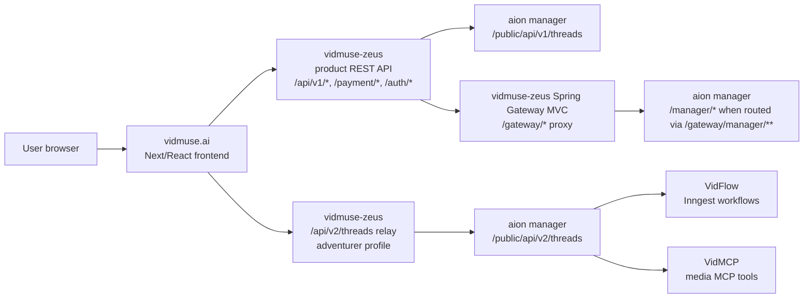

# 2026-07-02 aion / vidmuse-zeus / vidmuse.ai 代码扫描

## 扫描范围

- `~/Downloads/sandai-code/aion/`
- `~/Downloads/sandai-code/vidmuse-zeus/`
- `~/Downloads/sandai-code/vidmuse.ai/`

注意:`~/Downloads/sandai-code/zeus/` 不是当前 Vidmuse 业务的事实源;分析 Vidmuse 产品 API 时使用 `vidmuse-zeus/`。

## 总结

| 仓库 | 一句话定位 | 主要入口 |
|---|---|---|
| `aion/` | agent/runtime/media generation 后端平台 | `apps/manager`,`apps/runner`,`apps/vidflow`,`apps/vidmcp` |
| `vidmuse-zeus/` | Vidmuse 用户产品 REST API + AION relay + `/gateway/*` proxy | `modules/api`,`modules/domain`,`modules/infra`,`deployment/overlays/zeus-vidmuse-*` |
| `vidmuse.ai/` | 面向用户的 Web 前端 | `apps/vidmuse/src/app`,`src/api`,`src/view`,`src/store` |

## 跨系统心智模型



Confirmed:

- `vidmuse.ai` dev/PREVIEW rewrites `/api`,`/auth`,`/payment`,`/gateway` to `DEV_SERVER_PROXY_TARGET`.
- `vidmuse.ai` thread repository has default `/api/v1/threads` and adventurer `/api/v2/threads` profiles.
- `vidmuse-zeus` exposes `/api/v1/threads` for normal product thread APIs.
- `vidmuse-zeus` exposes `/api/v2/threads` through `AgentThreadRelayV2Controller`; this is a Java relay/controller, not Spring Gateway MVC config.
- `AgentThreadRelayV2Controller` checks current user/admin through `UserApiService`, resolves the stored `aion_thread_id` through `AgentService`, then calls AION via `AgentManagerClient`.
- AION manager mounts public app under `/public`, so `AgentManagerClient` calls paths like `/public/api/v2/threads/{aionThreadId}/messages/stream`,`/public/api/v2/threads/{aionThreadId}/document`,`/public/api/v2/threads/{aionThreadId}/live/messages`.
- `vidmuse-zeus` also has Spring Cloud Gateway MVC for `/gateway/*`; config example maps `/gateway/manager/**` to `dev-vidmuse-manager-service:443` with `strip-prefix=2`, which becomes AION `/manager/**`. This is separate from `/api/v2/threads`.

## aion

Confirmed from root `README.md`,`pyproject.toml`,and app READMEs:

- Python `3.10.18`,uv workspace.
- Workspace members:`apps/manager`,`apps/runner`,`apps/vidflow`,`apps/vidmcp`,`packages/*`.
- `manager`:FastAPI Thread Manager API; manages projects/API keys, JWT, Agent threads, workflow execution; app mounts `/public`,`/private`,`/manager`,`/model`; health `/health`.
- `runner`:agent runtime; local demo in `apps/runner/examples/oneshot-agent/narrative/main.py`.
- `vidflow`:Inngest worker; endpoint `/api/inngest`; health `/health`; metrics `/metrics`; workflow logic includes drawing shot images/references, shot video/avatar audio, render video.
- `vidmcp`:FastMCP Streamable HTTP server; MCP endpoint `/mcp`; media tools include image/video/music/speech generation, music analysis, file download, art style recall; async handoff uses `_aion_async` and `MANAGER_URL`.

Useful commands:

```bash
uv sync --all-packages
cd apps/manager && PYTHONPATH=. uv run fastapi dev
cd apps/vidflow && uv run uvicorn main:app --reload --host 0.0.0.0 --port 8000
cd apps/vidmcp && uv run python main.py
```

## vidmuse-zeus

Use `vidmuse-zeus/`, not `zeus/`.

Confirmed from `README.md`,Gradle files,controller scan,and relay client:

- Java / Gradle / Spring Boot API service.
- Java toolchain 23,Spring Boot 3.3.4.
- Modules:`api`,`common`,`config`,`domain`,`infra`,`openapi`.
- `modules/api` includes Spring Cloud Gateway MVC.
- Product API groups include user/auth,projects,threads/messages,agent events,tasks,generations,assets/images/voices,configs,credits/plans/payment,share/favorite/gallery/report/live/invitation/notification/platform APIs,feedback/orders,internal business/event/lark-bot.
- V2 adventurer relay:
  - Browser/API surface:`/api/v2/threads/**` in `AgentThreadRelayV2Controller`.
  - Zeus service layer resolves product thread id -> `aion_thread_id`.
  - AION upstream surface:`/public/api/v2/threads/**`.
- V2 multipart file bridge:
  - Browser/API surface:`/api/v2/agent/files/multipart-init` and `/multipart-complete`.
  - AION upstream surface:`/public/api/v2/oss/multipart-upload/initiate` and `/complete`.
- Gateway MVC:
  - Enabled by `zeus.gateway.enabled=true`.
  - Routes are configured under `zeus.gateway.routes[*]`.
  - Example manager route:`/gateway/manager/** -> http://dev-vidmuse-manager-service:443`, `strip-prefix=2`.

Useful commands:

```bash
./gradlew spotlessApply
./gradlew check
./gradlew :modules:api:bootRun --args='--spring.profiles.active=dev -Duser.timezone=UTC'
```

## vidmuse.ai

Confirmed from `README.md`,`apps/vidmuse/package.json`,`next.config.ts`,and service files:

- pnpm workspace; app is `apps/vidmuse`.
- Next `16.1.6`,React `19.2.0`,TypeScript,next-intl,MobX,Ant Design,Tailwind,SWR,Axios.
- Source layout:`src/app` routes,`src/api` generated clients,`src/component` reusable UI,`src/store` MobX store,`src/view` feature/page orchestration.
- API client uses `API_SERVER_URL` on server and `/` in browser.
- Dev/PREVIEW rewrites `/api`,`/auth`,`/payment`,`/gateway` to `DEV_SERVER_PROXY_TARGET`.
- Thread repository switches between default `/api/v1/threads` and adventurer `/api/v2/threads`.
- Config service keys include `tool_status_config_v1`,`pricing_page_config_v1`,`banner_config_v1`,`global_config_v1`,`model_list_config_v1`; VidMuse 2 chat mode whitelist uses Redis config key `vidmuse2_user_white_list`.

Useful commands:

```bash
pnpm install
pnpm --filter vidmuse dev
pnpm --filter vidmuse test
pnpm --filter vidmuse lint
pnpm --filter vidmuse typecheck
pnpm --filter vidmuse build
pnpm --filter vidmuse idl
```

## 待确认问题

- dev/staging/prod actual ConfigMap values for `aion.url`,`aion.project.token`,and `zeus.gateway.routes[*]`.
- aion manager 在目标环境的数据库/队列/runner deployment 组合。
- vidmuse.ai 的 IDL 生成链路如何从 `vidmuse-zeus` OpenAPI 更新到 `src/api/Api.ts`。

## 使用方式

涉及三仓库协作问题时,先用本页确定该从前端、产品 API 还是 agent runtime 切入;然后读对应 `systems/*.md` 和源码。若排查发现本页的 inference 已被配置或代码证实,把它提升为 confirmed 并更新本页。
